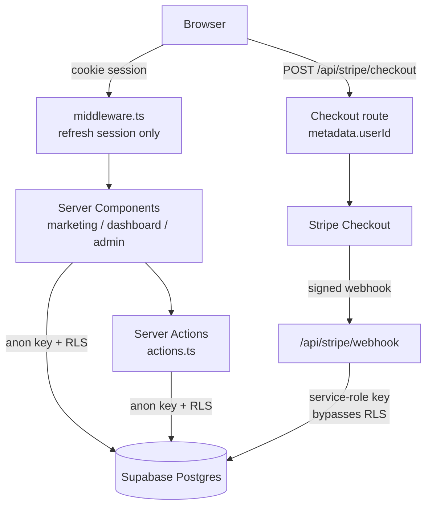

# 🛡️ Iron Fortress

**A subscription SaaS built end-to-end: Supabase auth, tier-based access control, and a working Stripe billing loop.**


> A high-ticket military-fitness coaching platform. The theme is deliberate — the point of the project was to build the *unglamorous* parts of a SaaS properly: session handling, a paid tier that a webhook actually grants, and an admin surface that isn't just a hidden route.

**▶ Live demo: [iron-fortress-system.vercel.app](https://iron-fortress-system.vercel.app)**

---

## Try it

Stripe runs in **test mode** — use card `4242 4242 4242 4242`, any future expiry, any CVC.

| Role | Clearance | Email | Password |
|---|---|---|---|
| User | OPERATOR (Level 1) | `charly@tester.com` | `test123` |
| Admin | Level 2 | `admin@ironfortress.com` | `admin123` |

*These are seeded demo accounts on a throwaway project. Nothing real lives behind them.*

---

## What this project demonstrates

1. **A billing loop that closes.** Checkout → Stripe → signed webhook → database tier change → gated content. Most portfolio SaaS projects stop at the pricing page; this one carries a `userId` through Stripe metadata and back.
2. **Authorization as a data concern, not a routing concern.** Access is decided server-side and backed by Postgres Row Level Security, rather than by hiding links in the UI.
3. **Next.js 16 App Router in anger.** Server Components for data, Server Actions for mutations, middleware kept deliberately thin.

---

## Architecture



### The three decisions worth explaining

**1. Middleware refreshes the session. It does not authorize.**

`src/middleware.ts` runs `supabase.auth.getUser()` to keep the SSR cookie session fresh, and redirects logged-in users away from `/login`. That's all it does.

It would have been shorter to put route guards in middleware. I didn't, because middleware runs before the request reaches the data layer, and a guard there controls what a user *may see*, not what they *may read*. Authorization instead lives in two places that actually touch data: server components (`verifyAdmin()` in `src/app/admin/layout.tsx`) and RLS policies in Postgres. If a query slips past the UI, the database still says no.

**2. Stripe and Supabase are bridged by `metadata.userId`.**

Stripe knows about customers; Supabase knows about users. Nothing links them by default. The checkout route (`src/app/api/stripe/checkout/route.ts`) writes the Supabase user id into the session metadata:

```ts
metadata: { userId: user.id }   // the bridge to the webhook
```

The webhook reads it back, verifies the signature with `stripe.webhooks.constructEvent`, and promotes the profile using a **service-role client** — the one place in the codebase that deliberately bypasses RLS, because a webhook has no user session to act on behalf of.

The trade-off: the downgrade path (`customer.subscription.deleted`) has no `userId` in scope, so it resolves the user by looking up the Stripe customer's **email**. That works, and it is the weakest link in the design — see *Known limitations*.

**3. Clearance is an ordered enum, not a boolean.**

```ts
export const CLEARANCE_LEVELS = { RECRUIT: 0, OPERATOR: 1, SHADOW: 2 } as const;
```

Comparing integers (`userLevel < requiredLevel`) means adding a tier later is a data change, not a code change. Workouts carry a `required_tier` column, so content gates itself.

### Data model

| Table | Purpose | Notable columns |
|---|---|---|
| `profiles` | Mirrors `auth.users`, holds the paid tier | `id`, `email`, `tier` |
| `workouts` | Training protocols, global or user-owned | `is_global`, `required_tier`, `difficulty`, `duration_minutes` |
| `workout_logs` | Completion history, drives the activity chart | `workout_id`, `created_at` |
| `articles` | Gated wiki/CMS content | `slug`, `category`, `security_level`, `author_id` |

---

## Tech stack

| Layer | Choice | Why |
|---|---|---|
| Framework | Next.js 16 (App Router) | Server Components keep auth-sensitive data on the server |
| Language | TypeScript, strict | — |
| UI | React 19 + React Compiler | Compiler removes most manual `useMemo`/`useCallback` |
| Styling | Tailwind CSS v4 | Zero-runtime; no CSS-in-JS cost on a content-heavy dashboard |
| Data / Auth | Supabase (Postgres + RLS) | Auth and authorization in one system, enforced at the row |
| Payments | Stripe Checkout + webhooks | Hosted checkout keeps card data entirely out of scope |
| Validation | Zod | Runtime validation at trust boundaries |
| Motion | Framer Motion | — |

---

## Known limitations

Written down because they're real, and because I'd rather discuss them than have them found.

- **The tier simulator overrides the real tier.** `src/components/debug/tier-switcher.tsx` writes a client-side `simulated_tier` cookie, and `dashboard/training/page.tsx` reads it with *priority over* the database value. Anyone can set that cookie in devtools and see gated workouts. It was built as a development affordance and shipped to the demo. It should be gated behind `NODE_ENV !== "production"`, and the DB value should win.
- **The paywall is presentational.** The training query fetches every eligible row and computes an `isLocked` flag for the UI, so the content of a locked workout is already in the payload. Real enforcement belongs in an RLS policy or a filtered query, not in a render branch.
- **Admin is a single hard-coded email.** `verifyAdmin()` compares `user.email` against `NEXT_PUBLIC_ADMIN_EMAIL`. The check itself is server-side and sound, but the `NEXT_PUBLIC_` prefix ships the admin address in the client bundle, and there is exactly one admin. This should be a role column or a JWT claim.
- **The webhook is not idempotent.** Stripe retries on non-2xx. There's no `event.id` ledger, so a retry re-applies the tier update. Harmless here because the update is idempotent by value, but the pattern doesn't generalise.
- **Subscription cancellation matches on email.** If a user changes their address in Stripe or Supabase, the downgrade silently misses. The fix is to persist `stripe_customer_id` on `profiles` at checkout.
- **Only two webhook events are handled.** `invoice.payment_failed`, `customer.subscription.updated` and `past_due` dunning states are unhandled — a failing card keeps its access.
- **The `SHADOW` tier has no self-serve path.** Only `STRIPE_PRICE_ID_OPERATOR` exists; SHADOW is admin-assigned.
- **`src/types/supabase.ts` is a stub, not generated.** It's a permissive `Record<string, unknown>` index signature, so Supabase queries type-check against nothing. Running `supabase gen types typescript` would surface real errors.
- **The schema lives in the Supabase dashboard, not in the repo.** There are no versioned migrations, so this repo is not reproducible from a clean project.
- **No automated tests.**

---

## Roadmap

- [ ] Gate `TierSwitcher` on `NODE_ENV`, and make the DB tier authoritative
- [ ] Move the paywall into RLS so locked content never leaves Postgres
- [ ] Persist `stripe_customer_id`; drop the email lookup
- [ ] Add a `stripe_events` table for webhook idempotency
- [ ] Handle `payment_failed` / `subscription.updated`
- [ ] Replace the env-var admin with a `role` column and an RLS policy
- [ ] Check in `supabase/migrations/` and generate real DB types
- [ ] Playwright coverage for the signup → checkout → unlock path

---

## Running locally

```bash
git clone https://github.com/B-Riemer/iron-fortress-system.git
cd iron-fortress-system
pnpm install
pnpm dev
```

Required environment (`.env.local`):

```env
NEXT_PUBLIC_SUPABASE_URL=
NEXT_PUBLIC_SUPABASE_ANON_KEY=
SUPABASE_SERVICE_ROLE_KEY=      # server-only; never expose
NEXT_PUBLIC_ADMIN_EMAIL=
STRIPE_SECRET_KEY=
STRIPE_WEBHOOK_SECRET=
STRIPE_PRICE_ID_OPERATOR=
NEXT_PUBLIC_BASE_URL=http://localhost:3000
```

Forward webhooks while developing:

```bash
stripe listen --forward-to localhost:3000/api/stripe/webhook
```

> **Note:** the Postgres schema is not yet versioned in this repo (see *Known limitations*). You'll need to create the four tables above in a Supabase project before the app has anything to read.

---

## Project layout

```
src/
├── app/
│   ├── (marketing)/          # public landing, legal pages
│   ├── (auth)/login/         # auth form + server actions
│   ├── dashboard/            # user area — training, intel, settings
│   ├── admin/                # gated by verifyAdmin() in layout.tsx
│   └── api/stripe/           # checkout + webhook routes
├── components/               # ui/ · dashboard/ · marketing/ · admin/
├── lib/
│   ├── supabase/             # client · server · admin (service-role)
│   ├── auth/admin.ts         # verifyAdmin()
│   └── types/                # clearance · workout · article
└── middleware.ts             # session refresh only
```

---

**Built by [Björn Riemer](https://github.com/B-Riemer)** · [b-riemer.dev](https://b-riemer.dev) · Portfolio project, Fachinformatiker AE (IHK)
